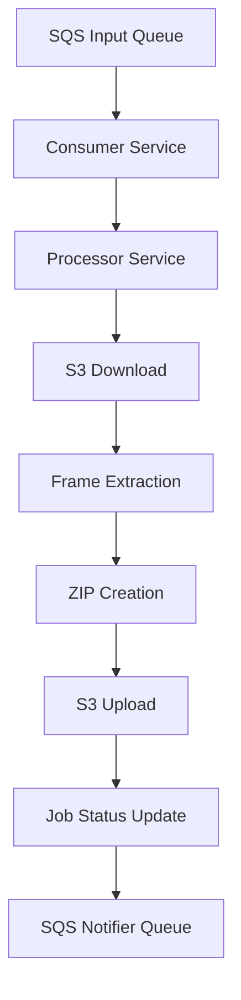

# Arquitetura do Sistema

## Visão Geral

O sistema de processamento de vídeos é baseado em uma arquitetura de microserviços que utiliza filas para processamento assíncrono. O sistema é composto pelos seguintes componentes principais:

- **Consumer Service**: Consome mensagens da fila SQS
- **Processor Service**: Processa os vídeos
- **Storage Service**: Gerencia armazenamento S3
- **Database**: PostgreSQL para persistência
- **Queue System**: AWS SQS para mensageria

## Diagrama de Arquitetura



## Componentes

### 1. Consumer Service

- Consome mensagens da fila SQS
- Valida formato das mensagens
- Gerencia concorrência
- Implementa retry policy
- Monitora processamento

### 2. Processor Service

- Download de vídeos do S3
- Extração de frames
- Compressão de vídeo
- Upload do resultado
- Tratamento de erros

### 3. Storage Service

- Gerenciamento de buckets S3
- Upload/download de arquivos
- Versionamento de objetos
- Políticas de retenção
- Backup automático

### 4. Database

- PostgreSQL para persistência
- Entidades principais:
  - VideoJob
- Migrações automáticas
- Backup regular

### 5. Queue System

- AWS SQS para mensageria
- Filas:
  - Input Queue
  - Notifier Queue
  - Dead Letter Queue
- Configurações:
  - Visibility Timeout
  - Message Retention
  - Retry Policy

## Fluxo de Dados

1. **Recebimento da Mensagem**

   ```
   SQS -> Consumer -> Validation -> Processing
   ```

2. **Processamento do Vídeo**

   ```
   S3 Download -> Frame Extraction -> ZIP Creation -> S3 Upload
   ```

3. **Atualização de Status**
   ```
   Database Update -> Notification Queue -> Status Update
   ```

## Segurança

### 1. Infraestrutura

- VPC para isolamento
- Security Groups
- Network ACLs
- Encryption em trânsito
- Encryption em repouso

### 2. Acesso

- IAM Roles
- Políticas mínimas
- Rotação de credenciais
- Monitoramento de acessos

### 3. Dados

- Sanitização de entrada
- Validação de formato
- Encryption de dados
- Backup automático

## Monitoramento

### 1. Logs

- Logs estruturados
- Níveis: INFO, WARN, ERROR
- Campos: timestamp, level, message
- Agregação centralizada

### 2. Métricas

- Processamento de mensagens
- Tempo de execução
- Taxa de sucesso/erro
- Uso de recursos

### 3. Alertas

- Falhas de processamento
- Erros de sistema
- Problemas de performance
- Violações de segurança

## Escalabilidade

### 1. Horizontal

- Múltiplas instâncias
- Load balancing
- Distribuição de carga
- Auto-scaling

### 2. Vertical

- Otimização de recursos
- Cache
- Connection pooling
- Query optimization

## Resiliência

### 1. Alta Disponibilidade

- Múltiplas AZs
- Failover automático
- Backup redundante
- Recuperação rápida

### 2. Tolerância a Falhas

- Retry policy
- Circuit breaker
- Dead letter queue
- Fallback strategies

## Performance

### 1. Otimizações

- Processamento paralelo
- Batch processing
- Caching
- Connection pooling

### 2. Limites

- Tamanho máximo de arquivo
- Taxa de processamento
- Concorrência máxima
- Timeout de operações

## Manutenção

### 1. Deploy

- CI/CD pipeline
- Blue/Green deployment
- Rollback automático
- Health checks

### 2. Backup

- Backup automático
- Point-in-time recovery
- Retention policy
- Teste de restauração

### 3. Monitoramento

- Health checks
- Performance metrics
- Error tracking
- Resource usage
