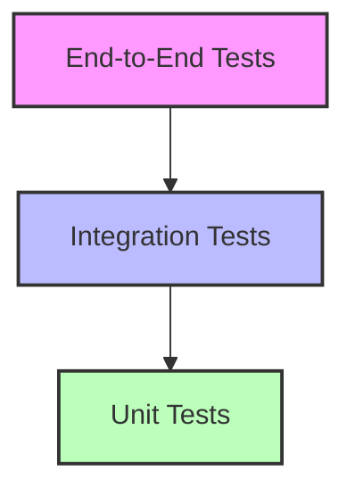

# Guia de Testes - Hackathon File Processor

## Índice

1. [Visão Geral](#visão-geral)
2. [Estratégia de Testes](#estratégia-de-testes)
3. [Tipos de Testes](#tipos-de-testes)
4. [Configuração](#configuração)
5. [Exemplos](#exemplos)
6. [Boas Práticas](#boas-práticas)
7. [Cobertura](#cobertura)

## Visão Geral

O Hackathon File Processor segue uma abordagem de testes abrangente, incluindo testes unitários, de integração e end-to-end. Esta documentação descreve as estratégias, ferramentas e práticas de teste utilizadas no projeto.

## Estratégia de Testes

### 1. Pirâmide de Testes



### 2. Distribuição de Testes

| Tipo       | Porcentagem | Descrição                             |
| ---------- | ----------- | ------------------------------------- |
| Unitários  | 70%         | Testes de componentes isolados        |
| Integração | 20%         | Testes de interação entre componentes |
| E2E        | 10%         | Testes de fluxos completos            |

## Tipos de Testes

### 1. Testes Unitários

#### 1.1 Estrutura

```typescript
describe('VideoProcessor', () => {
  let processor: VideoProcessor;
  let s3Service: S3Service;

  beforeEach(async () => {
    const module: TestingModule = await Test.createTestingModule({
      providers: [
        VideoProcessor,
        {
          provide: S3Service,
          useValue: mockS3Service,
        },
      ],
    }).compile();

    processor = module.get<VideoProcessor>(VideoProcessor);
    s3Service = module.get<S3Service>(S3Service);
  });

  describe('processVideo', () => {
    it('should process video successfully', async () => {
      // Arrange
      const file = Buffer.from('test');

      // Act
      await processor.processVideo(file);

      // Assert
      expect(s3Service.upload).toHaveBeenCalled();
    });

    it('should handle errors gracefully', async () => {
      // Arrange
      const file = Buffer.from('test');
      jest
        .spyOn(s3Service, 'upload')
        .mockRejectedValue(new Error('Upload failed'));

      // Act & Assert
      await expect(processor.processVideo(file)).rejects.toThrow(
        'Upload failed',
      );
    });
  });
});
```

#### 1.2 Mocks

```typescript
const mockS3Service = {
  upload: jest.fn(),
  download: jest.fn(),
  delete: jest.fn(),
};

const mockQueueService = {
  send: jest.fn(),
  receive: jest.fn(),
};
```

### 2. Testes de Integração

#### 2.1 Configuração

```typescript
describe('VideoProcessing Integration', () => {
  let app: INestApplication;
  let mongoConnection: Connection;

  beforeAll(async () => {
    const moduleFixture: TestingModule = await Test.createTestingModule({
      imports: [AppModule],
    }).compile();

    app = moduleFixture.createNestApplication();
    await app.init();

    mongoConnection = getConnectionToken();
  });

  afterAll(async () => {
    await mongoConnection.close();
    await app.close();
  });

  it('should process video and update database', async () => {
    // Arrange
    const videoFile = createTestVideo();

    // Act
    const response = await request(app.getHttpServer())
      .post('/videos')
      .attach('file', videoFile);

    // Assert
    expect(response.status).toBe(201);
    expect(response.body).toHaveProperty('id');

    const job = await mongoConnection
      .collection('jobs')
      .findOne({ _id: response.body.id });

    expect(job.status).toBe('processing');
  });
});
```

#### 2.2 Testes de API

```typescript
describe('Video API', () => {
  it('should upload video', () => {
    return request(app.getHttpServer())
      .post('/videos')
      .attach('file', 'test.mp4')
      .expect(201)
      .expect((res) => {
        expect(res.body).toHaveProperty('id');
      });
  });

  it('should get video status', () => {
    return request(app.getHttpServer())
      .get('/videos/123')
      .expect(200)
      .expect((res) => {
        expect(res.body).toHaveProperty('status');
      });
  });
});
```

### 3. Testes End-to-End

#### 3.1 Configuração

```typescript
describe('Video Processing E2E', () => {
  let app: INestApplication;
  let s3Client: S3Client;
  let sqsClient: SQSClient;

  beforeAll(async () => {
    // Setup test environment
    s3Client = new S3Client({ region: 'us-east-1' });
    sqsClient = new SQSClient({ region: 'us-east-1' });

    const moduleFixture: TestingModule = await Test.createTestingModule({
      imports: [AppModule],
    }).compile();

    app = moduleFixture.createNestApplication();
    await app.init();
  });

  afterAll(async () => {
    // Cleanup test environment
    await cleanupTestResources();
    await app.close();
  });

  it('should process video end-to-end', async () => {
    // 1. Upload video to S3
    const videoKey = await uploadTestVideo();

    // 2. Send message to SQS
    await sendTestMessage(videoKey);

    // 3. Wait for processing
    await waitForProcessing(videoKey);

    // 4. Verify results
    const result = await checkProcessingResult(videoKey);
    expect(result.status).toBe('completed');
  });
});
```

#### 3.2 Helpers

```typescript
async function uploadTestVideo(): Promise<string> {
  const file = createTestVideo();
  const key = `test-${Date.now()}.mp4`;

  await s3Client.send(
    new PutObjectCommand({
      Bucket: 'test-bucket',
      Key: key,
      Body: file,
    }),
  );

  return key;
}

async function waitForProcessing(key: string): Promise<void> {
  let attempts = 0;
  const maxAttempts = 10;

  while (attempts < maxAttempts) {
    const status = await checkVideoStatus(key);
    if (status === 'completed') return;

    await new Promise((resolve) => setTimeout(resolve, 1000));
    attempts++;
  }

  throw new Error('Processing timeout');
}
```

## Configuração

### 1. Jest

#### 1.1 jest.config.ts

```typescript
export default {
  moduleFileExtensions: ['js', 'json', 'ts'],
  rootDir: '.',
  testRegex: '.*\\.spec\\.ts$',
  transform: {
    '^.+\\.(t|j)s$': 'ts-jest',
  },
  collectCoverageFrom: ['**/*.(t|j)s'],
  coverageDirectory: '../coverage',
  testEnvironment: 'node',
  moduleNameMapper: {
    '^@/(.*)$': '<rootDir>/src/$1',
  },
};
```

#### 1.2 Scripts

```json
{
  "scripts": {
    "test": "jest",
    "test:watch": "jest --watch",
    "test:cov": "jest --coverage",
    "test:debug": "node --inspect-brk -r tsconfig-paths/register -r ts-node/register node_modules/.bin/jest --runInBand",
    "test:e2e": "jest --config ./test/jest-e2e.json"
  }
}
```

### 2. Ambiente de Testes

#### 2.1 Docker Compose

```yaml
version: '3.8'
services:
  test-mongodb:
    image: mongo:latest
    ports:
      - '27017:27017'
    environment:
      - MONGO_INITDB_DATABASE=test

  test-redis:
    image: redis:latest
    ports:
      - '6379:6379'
```

#### 2.2 Variáveis de Ambiente

```env
# test.env
NODE_ENV=test
MONGO_URI=mongodb://localhost:27017/test
REDIS_URL=redis://localhost:6379
AWS_REGION=us-east-1
```

## Exemplos

### 1. Testes de Serviço

```typescript
describe('VideoJobService', () => {
  let service: VideoJobService;
  let model: Model<VideoJob>;

  beforeEach(async () => {
    const module: TestingModule = await Test.createTestingModule({
      providers: [
        VideoJobService,
        {
          provide: getModelToken(VideoJob.name),
          useValue: {
            create: jest.fn(),
            findOne: jest.fn(),
            find: jest.fn(),
          },
        },
      ],
    }).compile();

    service = module.get<VideoJobService>(VideoJobService);
    model = module.get<Model<VideoJob>>(getModelToken(VideoJob.name));
  });

  describe('create', () => {
    it('should create a new job', async () => {
      // Arrange
      const jobData = {
        userId: 'user123',
        inputKey: 'video.mp4',
      };
      jest.spyOn(model, 'create').mockResolvedValue({
        ...jobData,
        _id: '123',
        status: 'pending',
      });

      // Act
      const result = await service.create(jobData);

      // Assert
      expect(result).toHaveProperty('_id');
      expect(result.status).toBe('pending');
      expect(model.create).toHaveBeenCalledWith(jobData);
    });
  });
});
```

### 2. Testes de Controller

```typescript
describe('VideoController', () => {
  let controller: VideoController;
  let service: VideoService;

  beforeEach(async () => {
    const module: TestingModule = await Test.createTestingModule({
      controllers: [VideoController],
      providers: [
        {
          provide: VideoService,
          useValue: {
            processVideo: jest.fn(),
            getStatus: jest.fn(),
          },
        },
      ],
    }).compile();

    controller = module.get<VideoController>(VideoController);
    service = module.get<VideoService>(VideoService);
  });

  describe('uploadVideo', () => {
    it('should process uploaded video', async () => {
      // Arrange
      const file = createTestFile();
      const result = { id: '123', status: 'processing' };
      jest.spyOn(service, 'processVideo').mockResolvedValue(result);

      // Act
      const response = await controller.uploadVideo(file);

      // Assert
      expect(response).toEqual(result);
      expect(service.processVideo).toHaveBeenCalledWith(file);
    });
  });
});
```

## Boas Práticas

### 1. Nomenclatura

```typescript
// Bom
describe('VideoProcessor', () => {
  it('should process video successfully', () => {});
  it('should handle invalid format', () => {});
  it('should retry on failure', () => {});
});

// Ruim
describe('VideoProcessor', () => {
  it('test 1', () => {});
  it('test 2', () => {});
  it('test 3', () => {});
});
```

### 2. Organização

```typescript
describe('Feature', () => {
  describe('Scenario', () => {
    describe('Given condition', () => {
      it('When action Then result', () => {});
    });
  });
});
```

### 3. Isolamento

```typescript
// Bom
beforeEach(() => {
  jest.clearAllMocks();
  jest.resetModules();
});

// Ruim
let sharedState;

beforeEach(() => {
  sharedState = {};
});
```

## Cobertura

### 1. Relatório

```bash
# Gerar relatório de cobertura
npm run test:cov

# Visualizar relatório
open coverage/lcov-report/index.html
```

### 2. Configuração

```yaml
coverage:
  statements: 80
  branches: 80
  functions: 80
  lines: 80
  exclude:
    - 'src/**/*.spec.ts'
    - 'src/**/*.module.ts'
    - 'src/main.ts'
```

### 3. Badges

```markdown


```
